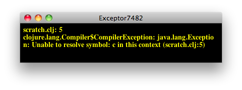

## 3.4 Exceptor

oplx name: `exceptor`

Openar has a logging facility to catch and print exception to log file. When an exception is reported to the logging facility, it also looks for the exception listeners registered to the logging facility and calls them with the exception object. Exceptor is one oplix using this feature.

Given an exception object Exceptor does:

1. open a window in the bottom-right corner of the display and show the detail message of the exception in the window, and
2. when it is possible to figure out the location where the exception was thrown, open Ced with the location information.

Exceptor can handle both compiler and runtime exception. But for runtime exception Exceptor handles it only when Openar lib is involved in the exception stack (you can get the list of Openar lib name prefix using the `get-openar-namespaces` function).

Besides, Exceptor won't open Ced if runtime exception is thrown from Ced (there is something wrong with Ced, so it can't be used).
