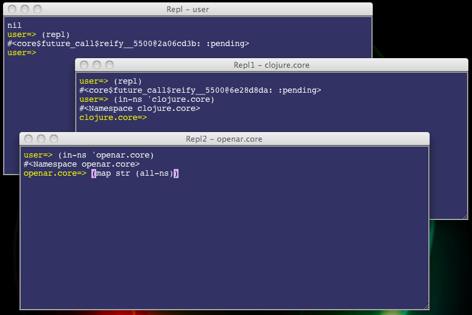

## 3.9 REPL

oplix name: `repl`

This oplix opens a window and runs the Clojure's read-eval-print loop, or REPL for short. You can open multiple REPLs. By default the REPL starts in the *user* namespace. The prompt shows the current namespace and matching parentheses on the command line will be highlighted as you type. Also wherever the caret is it comes back on the command line when you start typing.

In the REPL window there are some `repl` specific key bindings available in addition to the standard key bindings. The keys you would use most often are:

* CTRL+A and E to move the caret to the beginning and the end of line
* CTRL+F, B, P, and N to move the caret right, left, up, and down
* CTRL+H and D to delete a character next to the caret
* CTRL+U to delete characters by the beginning of the command line
* CTRL+R and V to scroll up and down a screen
* CTRL+C to interrupt eval process and get back to the prompt
* When the caret is on the command line the up and down arrow keys scroll back and forth command history
* When parenthesis is highlighted META+] move the caret to the matching parenthesis position
* META+; moves the caret to the beginning of the command line

You can also select text in the REPL window.

### 3.10.1 The "Repl" Instance and The clear-repl-content Function

Among `repl` instances the one named "Repl" (normally the very first `repl` instance) is special. It saves the text in the window when it closes and restores the text when it opens next time. There is no limit set for the text size currently, so it keeps growing up. Eventually you would need to clear it. To do that call the `clear-repl-content` function or its shorthand macro `crc`.

### 3.10.2 The replrc File

When the REPL starts, it loads a file called *`replrc`*. It is a startup script to configure the REPL environment. You can customize your REPL environment by editing the file. At the REPL call the `ced-replrc` function to open the `replrc` file and the `load-replrc` function to load it. If you corrupted the `replrc` file, open the REPL from the Openar by holding down the ALT key (the Option key on Mac OS X). Then call the `restore-replrc` function to restore the file.
